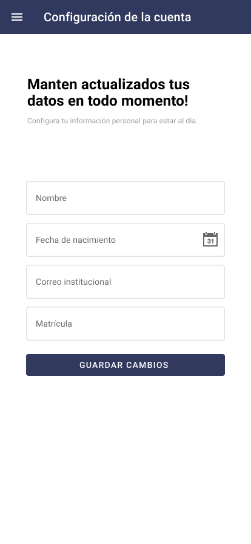
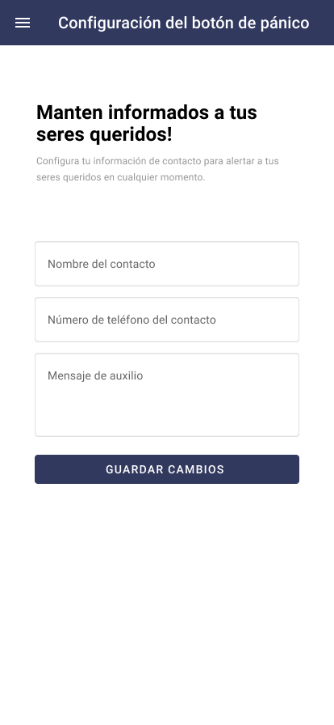

# Prototype

I used figma to design this prototype which will be implemented in react native.

## Login

## Signup [ Step 1 of 2 ]

## Signup [ Step 2 of 2 ]

## Home

## Navside

## Configuration

## Account Configuration

## Panic Button Configuration

